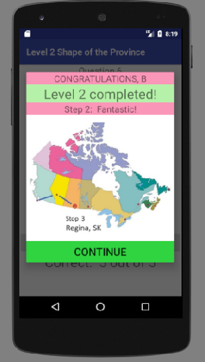

#  Great Canadian Race

## ***INTRODUCTION***

This version of the app is a demo version so that the features of the
app can be quickly demonstrated. The number of questions before
branching or assessment of progress is set to 5 where the final version
will be set to 25 to afford the user total benefit of the question base.
A storyboard of the levels is shown below

## ***GETTING STARTED***

After the user has installed the app, the next step will be login.

For the evaluation of specific levels, use the database section below to
find an appropriate login.

***RESULT***

Screenshot examples of the individual levels are given below:

LogOn Screen Level 1: Name the province Level 2: Name the outline

Level 3: Give the direction Level 4: Name the capital Level 5: Give the
neighbours

Level 6: Provincial Flags Level 7: Provincial Abbreviations Level 8:
Provincial Birds

Level 9: Provincial Flowers Level 10: High Score Level 10: High Score

Level 10: High Score Level Completed

***  
***

***DATA MODEL***

This demo version of the database is simplified using none of the
security features of the host application, FIREBASE.

The database has three “root” nodes:

-   dummy – a test user used soley for testing. This root will be
    eliminated in the final version

-   users – a list of authorized users (A-O) with current levels (1-10).
    In the final version, only the teacher will have access to the
    database to add new users.

-   Score – a list of users with their current high score. By default,
    new users will be set to 999. In the final version, only the teacher
    will have access.

***DATABASE RULES***

The current demo app database has no security and is totally open as
shown in the below image.

Scores are indexed in ascending order for improved access speed.

***SUPPORT***

The current development team may be contacted at <lmasters@algomau.ca>
for questions and suggestions

***LICENCE***

This app is copyrighted and use is solely for evaluation purposes.
